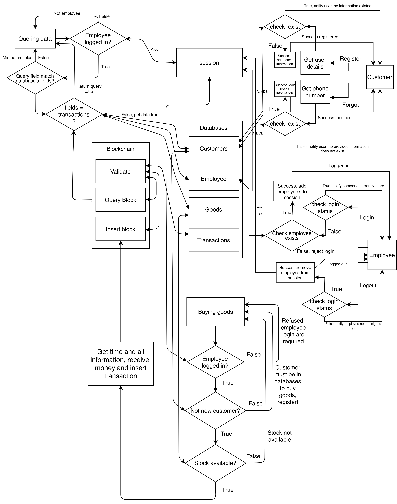

# Topic-Proposal

<div id="top"></div>
This repo contains all the source code and obtained data for the topic "Introduction to Blockchain and its applications in
managing SME"


<!-- PROJECT LOGO -->
<br/>
<div align="center">
  <a href="https://github.com/Hyprnx/used-cars-prices-prediction">
    
  </a>
  <h3 align="center">Simple data flow in this project (if you cant see anything, switch to light mode)</h3>
</div>

## About this project

The current problems is that mainly everything is build on trust (or faith if you prefer). This problems make transactions harder than it should be. Since how can some person trust some other one when they dont know each other? So, how to quickly process transactions for everybody, with the information is that the transactions possibly involving multiple people, in an environment might not always honest, where people may not trust one another? Our society has hundreds, or thousands of years been relying on the intermediaries to solve that problem. If we do not trust each other, we will do the transaction through a trusted middleman in this situation: a trusted-by-many- financial-institution, namely, the Bank! But the trust placed in intermediaries is an assumed trust; we assume that they will do what they are supposed to do in the ideal scenario, which is not the case in practice; humans make mistakes, machines fail all the time, hackers are always looking for ways to penetrate into the systems, and even in an ideal world where such errors or attacks do not occur, the conventional way of relying on a central authority to store information, process transactions, or manage systems is flawed. It is increasingly expensive in both money and time when there are more workload. 

Blockchain overcomes the weakness of the current cen-tralized systems. It is comprehensively decentralized with absolutely no intermediaries involved. Blockchain approach the problem with four imperative aspects:

• Trust

• Security

• Privacy

• Transparency

Blockchain can provide the above desirable properties thanks to its decentralized network architecture, utilizing by many computers on the internet. These computers can continuously store and process transactions in a autonomous mechanism, but also, they are still able to achieve agreement in decision making and be guarded against hacker attacks, system malfunctions, users dishonesty, and self interests. Using the internet, one may send data from one computer to another without having to worry about how the data will be delivered or if it will be lost. The internet and Blockchain system manage all of that, enabling individuals to focus on the important business work at hand. Similarly, when people transact on the blockchain, they don’t have to worry about a slew of what-if scenarios, such as whether the other party will act as agreed, if money will be lost, or data will be illegally altered.

This report includes two big sections: 

• Introduction to Blockchain and how it works. 

• Coding demo with Blockchain applications in managing SME.

This report were made with introduction purposes, so all complicated mathematical have been cut-off for reader- friendly purposes. For detailed version, we recommend reading the book and other references we have included in the end of the report. Reports and project contributions can be found in the end of the report as well. The report can be found here: [Report](report/report.pdf).

This project is the second big section, it will be our proposal for a proof-of-concept project that implemented a system to help a small convenience store or convenience chain in managing the store, using some simplified version of the Blockchain’s four aspects. We implemented a system that allows the managers or the shareholders to directly view the transactions that were made, with complete trust. This proof of concept system also helps SMEs to reduce the operation costs by giving them a simple tool that automatically does the accounting to eliminate the cost of hiring accountants. The system can provide data for the authorities to help them do taxes and other regulations without the need of humans. The proof-of-concept system was built with the help from Flask and MongoDB (via Pymongo) with Python.


<p align="right">(<a href="#top">back to top</a>)</p>

## Requirements
This projects requires [MongoDB](https://www.mongodb.com/) as the database so please be sure to install MongoDB to your machine first,[Click here to download]([https://www.mongodb.com/](https://www.mongodb.com/try/download/). Tutorials can be found on the internet.


The port for MongoDB to work with on our machine is 27017, you can change this to the correct port where MongoDB run on your machine, simply go to [connect to database](common/mongo_db_connect.py) and change the host and port to the correct host and port that you want. 

To ensure that the demontration works, we have included sample data file for you to work with. The sample can be found in [sample data](sample_data), you can try to insert these data directly to MongoDB.

<p align="right">(<a href="#top">back to top</a>)</p>

<br/>

## Getting Started
Open Terminal / cmd and do the following:
### Create and activate virtual environment
#### Create
 ```sh
  python -m venv <envname>
  ```

#### Activate

- On Mac:
  ```sh
  source <envname>/bin/activate
  ```
- On Windows:
  ```sh
  <envname>\Scripts\activate
  ```

### Install requirements.txt
  ```sh
  pip install -r requirement.txt
  ```
<p align="right">(<a href="#top">back to top</a>)</p>

<br/>

## License
Distributed under the GNU General Public License v3.0 License. See `LICENSE.txt` for more information.
<p align="right">(<a href="#top">back to top</a>)</p>

<br/>

## Contact us
[To Duc Anh](mailto:toducanh2001@gmail.com)


<p align="right">(<a href="#top">back to top</a>)</p>


